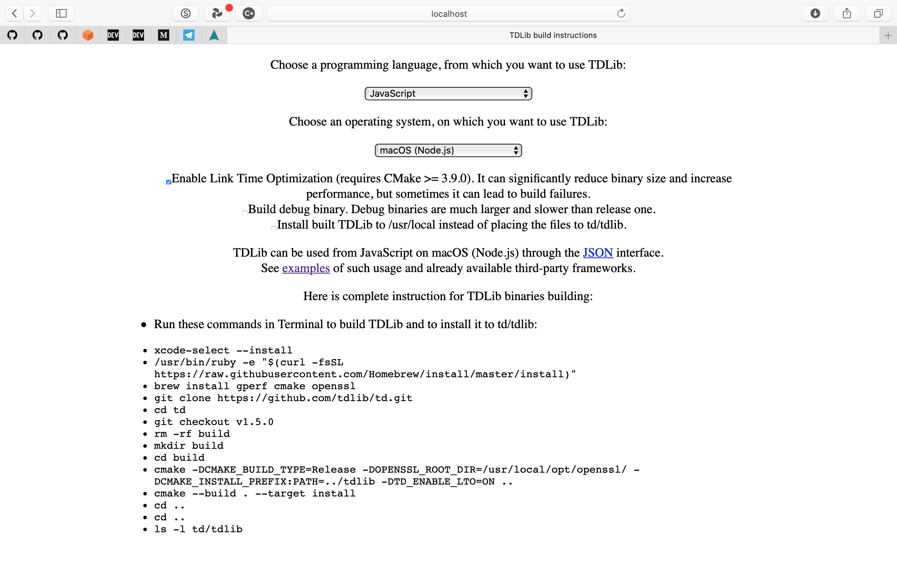

# Basic usage Airgram with TypeScript UnOfficial Example

This is an example of basic usage [Airgram](https://github.com/airgram/airgram) for creating Telegram client with TypeScript. I could not get the example from that repo to run mostly likely because I do not have the familiarity with which would have let me understand all the intracies of building this and that were not included in the docs. So here is how I got this to work.

## TLDR

I had to do all of the below when using `pnpm`. If you use `yarn` the example in at `https://github.com/airgram/airgram/tree/master/examples/getting-started` should work after from that repo after you follow these steps.

## Overview

First, you should understand that this is a terminal program. It does not provide a browser user interface. When it runs it will be in the terminal where you ran `npm run start`.

Building this example requires building [TDLib for JavaScript](https://github.com/tdlib/td/tree/master/example#tdlib-usage-and-build-examples) which I did using the suggested [TDLib build generator](https://tdlib.github.io/td/build.html).

The instructions are used will look like these: 

The docs say there is a `convienent` way to use this on Macos with Node which I could not figure out. You can see those instructions [here](https://github.com/tdlib/td/blob/master/example/README.md#using-tdlib-in-javascript-projects).

After you have built TDLib, proceed to the next steps. The file you will need is `~/td/tdlib/lib/libtdjson.dylib`. I built `tdlib` in my root directory. Run `cp ~/td/tdlib/lib/libtdjson.dylib ./tdlib` which will copy `libtdjson.dylib` into `./tdlib/libtdjson.dylib`. Then add it to the `.env` file which should look like:

```json
APP_ID="333333"
APP_HASH="333333333333473333333333333"
TDLIB_COMMAND="./tdlib/libtdjson"
```

## APP_HASH & APP_ID

To get your Telegram API `id` and `hash` go to [http://my.telegram.org](http://my.telegram.org) and follow the instructions. Add those to your `.env` file.

## @airgram/core

If you are here because of the `isError` `isObject` export errors, the example, as of today is not updated. `isError` and `isObject` are now exported from `@airgram/core`. To fix those errors you want to `npm install @airgram/core` then go into `src/index.ts` and change:

```ts
import { Airgram, Auth, isError, prompt, toObject } from 'airgram'
```

to

```ts
import { isError, toObject } from '@airgram/core'
import { Airgram, Auth, prompt } from 'airgram'
```

## Installation With This Example

1. Clone repository by clicking the green `Use Template` button or cloning:

```bash
git clone https://github.com/idkjs/airgram-getting-started.git
```

2. Install dependencies:

```bash
npm install
```

3. Run example:

```bash
npm run dev
```

I hope this helps.
